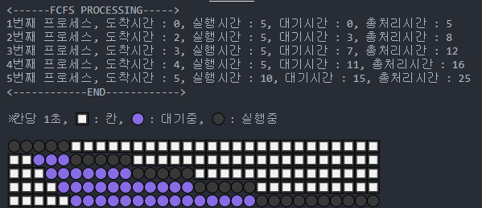
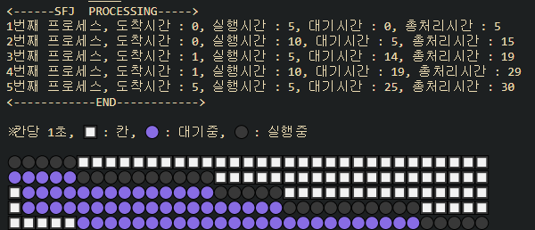

# system_process

10월 20일 fcfs 완료



10월 23일 SJF 완료



RR 미구현

SRT 미구현


# 코드설명
+ 모든 코드에 적용한 코드
```c++
struct setting process_sort(struct setting s, int size) {
    for(int i = 0; i < size - 1; i++) {
        for(int j = i + 1; j < size; j++) {
            if(s.arrivalTime[i] > s.arrivalTime[j]) {
                int temp_arrivalTime = s.arrivalTime[i];
                int temp_workTime = s.workTime[i];
                //arrivalTime 정렬
                s.arrivalTime[i] = s.arrivalTime[j];
                s.arrivalTime[j] = temp_arrivalTime;
                //workTime 정렬
                s.workTime[i] = s.workTime[j];
                s.workTime[j] = temp_workTime;
            }
        }
    }
    return s;
}
```

+ 구조체를 사용하여 도착시간을 정렬해주는 선택정렬이다. 어떤 프로세싱이든 도착순서에 따라서 입력이 되기 때문에 제일 먼저 이것으로 구조체의 도착순서를 정렬을 해준다.


```c++
printf("※칸당 1초, 🔲 : 칸, 🟣 : 대기중, ⚫ : 실행중\n\n");
    for(int i =0; i< size; i++) {
        waiting_time = 0, total_process = 0;
        for(int j = 0; j < total; j++) {
            if(gantt[i][j] == 0) { printf("🔲"); }
            else if(gantt[i][j] == 1) { printf("⚫");  }
            else if(gantt[i][j] == 2) { printf("🟣");}
        }
        printf("\n");
    }
```
+ FCFS나 SJF나 둘다 정렬을 통해 배열에 0 1 2를 저장시켜 간트차트를 그린다. 이 배열을 가지고 1개의 개수 2의 개수에 따라서 총처리시간 대기시간을 구할 수 있다.
+ FCFS는 위에 설명했던 정렬코드 하나로 해결이 가능하다.

```c++
for(int a = 0; a < size - 1; a++) {
        for(int b = a+1; b < size; b++) {
            if(s.arrivalTime[a] == s.arrivalTime[b] && s.workTime[a] > s.workTime[b]) {
                int temp;
                temp = s.workTime[a];
                s.workTime[a] = s.workTime[b];
                s.workTime[b] = temp;
            }
        }
```

+ SJF는 위의 정렬코드에서 한번더 정렬을 해줘야 하기 때문에 위의 코드를 사용해서 또 다시 선택정렬을 해주었다. 

+ 이걸로 FCFS랑 SJF는 
